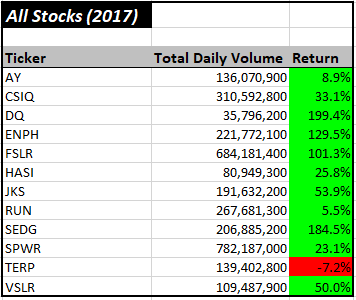
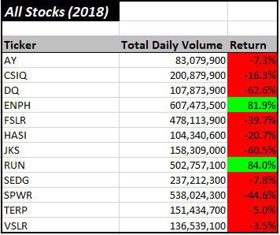
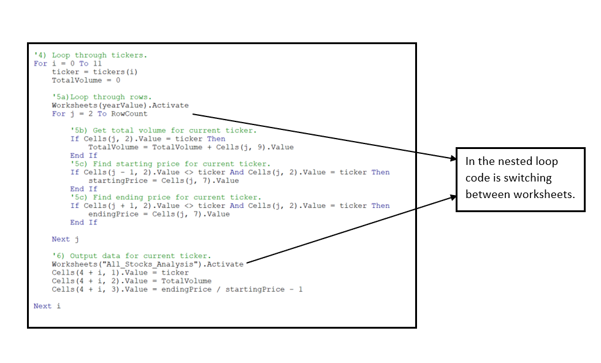
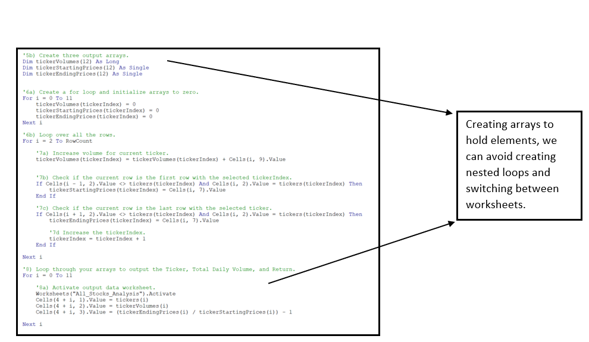
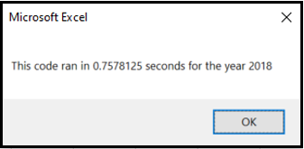
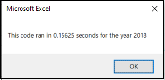

# Green-Energy Stocks Analysis

*VBA stock-market analysis*

## Overview of Project
### Background 
In this project, I am performing data analysis for green-energy stocks (from the year 2017 and 2018), in order to analyze their
- [x] Yearly Return and
- [x] Total Daily Volume.

For this data analysis I am using Microsoft ***Visual Basic for Applications*** or short ***VBA*** as a tool, including **conditional statements**, **for loops**, **static and conditional formatting**, and nevertheless **code refactoring** in order to improve its efficiency and clarity.

A general idea using VBA is to automate tedious processes, improve the efficiency and uniformity of the analysis output, to reduce the chances of accidents and errors and to write a code that can be used for similar future projects. The coding part in VBA (as well as in any other programming language) is not a one-time deal, yet is an ever-growing and ever-improving task. We can come back to the “old code”, and rewrite to make it work better. To highlight the importance of **refactoring** this analysis heavily focuses on this topic. In  file are two .vbs modules that contain VBA code **before refactoring (Module 1)** and **after refactoring (Module 2)**.

### Purpose
The purpose of this analysis is to help Steve analyze the green-energy stock market for his parents. They are interested in investing in DAQO stocks (Ticker: DQ), which is *new energy stocks corporation*, a company that makes silicon wafers for solar panels. Before investing their money, Steve wants to run some analyses in order to check DQ stocks status and performance over the years in comparison to other green-energy stocks. Results will help him determine if DQ stocks are worth investing his parents’ money.

<p align="center">
<kbd>   

</kbd>
</p>

```In this report``` :recycle: ```symbol is used to highlight the findings for Steve.```

## Results
### Analysis of green stocks for 2017 and 2018

The table below displays the analysis for a dozen green-energy stocks (for companies that use alternative energy rather than fossil fuels in the form of Hydroelectricity, Geothermal energy, Wind Energy, and Bio Energy). The table contains three groups of data:
- Ticker name.
- Total daily volume for a given year.
- Percentage of a yearly return. 

<p align="center">
    
</p>

#### Yearly return (%)

Green-energy stocks in 2017 have a high ratio of positive yearly returns (only one green-energy stock (TERP)) has a negative yearly return. Analysis from 2018 shows a completely different picture. The majority of stocks have negative returns. The drop is significant. The DQ stocks had nearly 200% positive yearly return in 2017, but in 2018 the stocks dropped and closed the year with negative 63% of the yearly return. 

:recycle: These results indicate a risky investment. The stock trend is not stable and might not be worth investing all the money in DQ stocks.

#### Daily volume 

In general, a high volume of daily trading is an indicator of a stable stock, with a lot of interest and activity. It is true that in some cases low trading volume can be promising, especially where companies “that have yet to be discovered”(1). 

:recycle: DQ stocks in 2017 had low volume and high yearly return (at that time this might be an indicator of a company on a rise). However, the situation of DQ stocks in 2018 has changed completely. Stocks closed its year with negative 63%. Trading volume was higher, yet didn’t result in a positive outcome. Results of this analysis confirmed a risky investment in DQ stocks.

### The code behind the table 
Both codes **“AllStockAnalysis”** and **“AllStockAnalysisRefactored”** have the same output. Codes run calculations from the following  and return data on a new worksheet **All_Stock_Analysis**. The idea of presenting two codes with the same output is to highlight the importance of refactoring.

#### Ticker (column A):
Array `Dim tickers(12) As String` holds 12 elements - tickers. `tickerIndex`, a new variable accessing array indexes and returning values in the table. 

####  Total Daily volume (colum B): 
The following code calculates **The Total Volume** for specific ticker: `tickerVolumes(tickerIndex) = tickerVolumes(tickerIndex) + Cells(i, 9).Value` To make this code work we need to create an array `Dim tickerVolumes(12) As Long` that holds 12 elements, and use our new variable `tickerIndex` to access ticker index in order to store the right value for the right ticker. 

####  Yearly Return (colum C):

The following code calculates **Yearly Return**
```
If Cells(i - 1, 2).Value <> tickers(tickerIndex) And Cells(i, 2).Value = tickers(tickerIndex) Then 
    tickerStartingPrices(tickerIndex) = Cells(i, 7).Value
End If

If Cells(i + 1, 2).Value <> tickers(tickerIndex) And Cells(i, 2).Value = tickers(tickerIndex) Then
    tickerEndingPrices(tickerIndex) = Cells(i, 7).Value
End If
```
To make this code work we need to use conditionals or `if statements`. As before, the variable `tickerIndex` helps us find the start and endpoint of an old/new ticker in the dataset. Arrays `Dim tickerStartingPrices(12) As Single` and `Dim tickerEndingPrices(12) As Single` store captures values.
In “human” language we would read the following code something like this: *If the cell value in previous row (2nd column) is not the same as current cell value (2nd column), (that means the ticker index reached a starting point of the new ticker), then capture the value for starting price of a new ticker in a current row (7th column) and store it in a “container” named tickerEndingPrices under label “current” tickerIndex.*

#### For loops
For loops are responsible for executing the code in a repetitive manner until the condition is met. 
Incrementing a variable by 1  `tickerIndex = tickerIndex + 1` is  responsible to move to the next ticker.
By initializing arrays `tickerVolumes(tickerIndex) = 0` we reset the total volume to zero, before entering the loop again. 

#### Formatting 
In order to make final table (outpt) organized and visually pleasing, we add static or conditional formatting.

```
Range("A1").Font.Italic = True
Cells(1, 1).Font.Size = 14
Range("B4").NumberFormat = "#,##0"
```
All formating that is possible in Excel, we can do it in VBA. By selecting a cell `Cells(1, 1)` or a range `Range("A3:C3")` we define where we want to apply formatting.
There are plenty useful sites online like [this](https://www.excelhowto.com/macros/formatting-a-range-of-cells-in-excel-vba/) where we can find clear formatting instructions. 

```
 If Cells(i, 3) > 0 Then 'set a condition
    Cells(i, 3).Interior.Color = vbGreen 'color cell green
                 …
End If
```
Additional to Static formatting we can integrate an `if statememts` in order to set a condition for formatting.

### Code comparison
As mentioned earlier in the analysis I write two VBA skripts in order to higlight the importance of refactoring. The table below shows the difference in the code.


Code before refactoring (Module 1). |  Code after refactoring (Module 2).
:------------------------------------------:| :-------------------------------------:
Code with nested loops(click on the picture to enlarge)  | Code without nested loops(click on the picture to enlarge) creating multiple loops	
 | 
The code is switching back and forth between worksheets what is time-consuming. Nested loops are great and are used to cycle through the matrix and tabular data, yet they can be process-intensive. | Code stays in the same loop, gathers all data, store it in an array, then in another for loop the results are populated in the selected worksheet.  
 Execution times |  Execution times 
 | 

<p align="center">
:heavy_check_mark: **The refactored code ran almost 5x faster.***   
</p>

## Summary

### What are the advantages or disadvantages of refactoring code?

:leaves: The purpose and the ***advantages*** of refactoring code are to improve code:

- **efficiency** (code is taking fewer steps, therefore taking up less computer memory and taking-up less time to execute the code), 
- **readability** (code is easier to understand, it’s cleaner as a result of improved logic of the code), 
- **functionality** (fixing any bugs that might have been overlooked in the original code).

:leaves: On the other hand, ***the downsides*** of refactoring code (ours or someone elses) can be:

- **frustrating** and **time-consuming**. We might not be aware of the purpose of the code and its functionality. This can be even more difficult if the code is not well commented and we would spend a lot of time figuring out what specific lines or blocks of code are supposed to do. Moreover, by refactoring the code, we could be taken a long way, making code less efficient or even break the code. 

### How do these pros and cons apply to refactoring the original VBA script?

There is no doubt that this analysis was challenging. Refactoring VBA script was a bit **frustrating** (when code wasn’t executed the wanted output), a bit **confusing** (when the understanding of the basics wasn’t under the belt yet, the advanced techniques were misleading), and **time-consuming** (it took-up quite a bit of time to finish the challenge). Yet, on the other hand, was extremely **rewarding** and **fulfilling**. This technique added up another level of coding -- that is -- deepened the understanding of the logic of the code. Hard work was paid off with new knowledge and understanding of the complex structure of the code.

Other advantages of refactoring the code are, that code ran much faster, **5-times faster**, by the code taking fewer steps (it didn’t switch back and forth between the worksheets). Another bigger improvement of the code was to access the arrays with a single variable `tickerIndex`. In this case, code stored all elements in arrays before switching to another worksheet. By doing this we were able to avoid nested loops, that can be quite process-intensive.

## References
(1) “Is a Stock's Trade Volume Important?, https://www.investopedia.com/articles/investing/060315/stocks-trade-volume-important.asp#:~:text=If%20you%20see%20a%20stock,more%20demand%20for%20that%20stock.,Web 23 Jul 2020.)


## Additional useful articles
- [Arrays](https://docs.microsoft.com/en-us/office/vba/language/concepts/getting-started/using-arrays)
- [ColorIndex](http://dmcritchie.mvps.org/excel/colors.htm)
- [Variables](https://powerspreadsheets.com/declare-variables-vba-excel/)
- [Formatting](https://www.excelhowto.com/macros/formatting-a-range-of-cells-in-excel-vba/)

